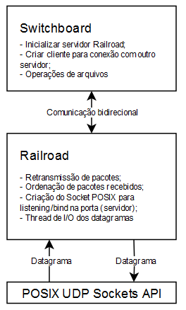
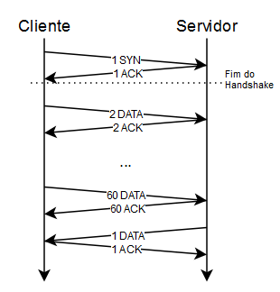

Desenvolvimento de envio de arquivo via Socket UDP.
Objetivo do Projeto: Desenvolver um sistema de transferência de arquivos utilizando sockets UDP, com implementação de mecanismos para garantir a ordenação dos pacotes e a retransmissão dos pacotes perdidos, a fim de assegurar a integridade dos dados recebidos.

Servidor deverá ter 3 funcionalidades:

1. Receber e armazenar em uma pasta os arquivos de enviados por todos os clientes.
2. Enviar lista de arquivos da pasta quando solicitado pelo cliente.
3. Transmitir um arquivo da pasta quando solicitado pelo cliente.

Cliente deverá ter 3 funcionalidades:
1. Selecionar um arquivo local e transmitir para o servidor.
2. Visualizar os arquivos da pasta.
3. Solicitar e fazer download de um arquivo da pasta.

Deve garantir ordenação dos datagramas e retransmissão de datagramas perdidos. IMPLEMENTAR ORDENAÇÃO E RETRANSMISSÃO DE DATAGRAMA PERDIDO. NÃO DEVE USAR IMPLEMENTAÇÕES PRONTAS.
Passo a passo detalhado para a realização da atividade:
1. Estudo: Antes de começar o desenvolvimento, os alunos devem dedicar um tempo ao estudo dos conceitos necessários para a realização do projeto. Isso inclui o entendimento socket UDP, as funcionalidades do módulo socket e o modelo cliente-servidor na linguagem escolhida.
2. Desenho da arquitetura: No início do projeto, os alunos devem desenhar a arquitetura da aplicação, definindo como o cliente e o servidor irão interagir. Desenvolver um fluxograma da lógica criada e colocar no relatório.
3. Implementação do Servidor: Os alunos irão começar a implementação pelo servidor, usando sockets UDP. O servidor deverá ser capaz de aceitar várias conexões em paralelo (multithreading).
4. Implementação do Cliente: em seguida, os alunos irão implementar o cliente, que também utilizará sockets UDP. Os clientes deverão ser capazes de solicitar a lista de arquivos, realizar download do arquivo desejado e enviar um arquivo para o servidor.
5. Testes: após a implementação, os alunos irão testar a aplicação, simulando um cenário real de uso. Testar comunicação em na mesma LAN, use os comutadores do SENAI.
6. Documentação: os alunos irão documentar todo o desenvolvimento, explicando as decisões tomadas, como o projeto evoluiu, quais problemas surgiram e como foram resolvidos, entre outras informações importantes.

A documentação seguirá o seguinte formato:
1. Introdução: Apresente o tema UDP e Socket e suas características.
2. Desenvolvimento: Detalhe o trajeto do grupo durante a realização do projeto, o percurso de aprendizado, as principais dificuldades encontradas e como foram superadas. Explicite bem as tecnologias utilizadas e por quê foram escolhidas. Aqui, os alunos também precisam apresentar um fluxograma da estratégia adotada, bem como a implementação e os resultados dos testes.
3. Conclusão: Mostre a participação de cada membro no projeto. Os alunos devem retomar os principais pontos do trabalho, mostrar os resultados alcançados e os aprendizados adquiridos durante o projeto. Destaque o que deu certo e o que poderia ser melhorado em projetos futuros.
4. Bibliografia: Liste todas as fontes de onde você extraiu informações pertinentes ao projeto, incluindo livros, vídeos, sites e etc.

---------------------------

Início da Documentação

# Uma aplicação simples de transferência de arquivos

## 1. Introdução

O protocolo UDP (User Datagram Protocol) é um protocolo de datagramas utilizados na camada de transporte (camada 4) do modelo OSI. Ele fornece uma abstração de comunicação entre aplicações, permitindo a transmissão de pacotes (datagramas) em rede IP ou outra rede de dados.

Um datagrama é uma unidade básica de dados que pode ser transmitido individualmente através de uma rede. Os datagramas são independentes um do outro e podem ser recebidos em qualquer ordem, com ou sem erros. 

O protocolo UDP não fornece nenhuma garantia de entrega, nem garante a ordenação dos pacotes. Também não oferece mecanismo para retransmissão de pacotes perdidos ou corrompidos. Além disso, não existe o conceito de uma conexão estabelecida e contínua entre os dois pontos da comunicação -- os datagramas são simplesmente enviados a um conjunto de IP e porta especificado, e não são garantidos a serem recebidos em ordem, em contraste ao protocolo TCP, que, por sua vez, oferece uma abstração de conexão persistente e confiabilidade entre os dois pontos da comunicação, com uma visão de corrente (stream) de dados.

Mesmo assim, o protocolo UDP é muito utilizado em aplicações onde a latência é mais importante do que a confiabilidade, como por exemplo, a transmissão de video ou áudio em tempo real, ou jogos multiplayer competitivos em tempo real.

O objetivo do projeto é desenvolver um sistema de transferência de arquivos utilizando sockets UDP. A aplicação tem como requisito garantir a ordenação dos pacotes e a retransmissão dos pacotes perdidos, estabelecendo uma conexão confiável entre um cliente e servidor.

Com base nesses requisitos, dividimos o projeto em duas etapas:

1. O desenvolvimento da biblioteca/protocolo Railroad, que é responsável pela comunicação baixo nível entre o cliente e o servidor;
2. A aplicação Switchboard, que utiliza a biblioteca Railroad para realizar a transferência de arquivos.

## 2 Componentes do projeto

### 2.1 A biblioteca Railroad

A biblioteca Railroad foi desenvolvida em C++, sua API modelada com inspiração em sockets Berkeley (BSD) e POSIX, e seu funcionamento inspirado no protocolo TCP. Ela implementa os conceitos de cliente/servidor, conexão confiável por meio de mensagens de acknowledgement (ACKs) e retransmissões de pacotes perdidos.

O funcionamento da biblioteca Railroad, pelo menos do lado do cliente, pode ser resumido em 3 etapas:

1. Abertura de uma conexão com o servidor;
2. Envio dos dados para o servidor;
3. Espera pela confirmação (ACK) do servidor.

No servidor, a biblioteca Railroad recebe os dados e, após a confirmação da recepção, gera um datagrama ACK e envia-o ao cliente. Caso haja algum erro na transmissão ou recepção dos pacotes, o protocolo entra em um loop de retransmissões até que a mensagem seja confirmada com sucesso.

O funcionamento interno do servidor é semelhante ao cliente, com diferenças relacionadas a necessidade de suportar vários clientes ao mesmo tempo e recepcionar a abertura de conexões com clientes novos.

Para atender o requisito de ordenação correta dos pacotes recebidos, foram pesquisados diversos mecanismos de ordenação. Inicialmente, foi implementada a estratégia de transmissão Stop-and-Wait, onde cada pacote enviado obrigatoriamente aguarda a confirmação do servidor antes de enviar o próximo. Ela possui algumas vantagens, como uma implementação mais simples e a capacidade de garantir que os pacotes sempre chegarão na ordem correta, já que só um pacote é enviado por vez.

No entanto, essa estratégia pode ser extremamente ineficiente em condições de alta latência ou com transmissões em redes onde muitos dados estão sendo enfileirados para transmissão. Para contornar esse problema, foi implementada a estratégia de Sliding Window (janela deslizante), que permite o envio de vários pacotes de forma simultânea,  com um limite máximo de pacotes por vez.

A linguagem escolhida para a implementação foi o C++ por ser uma linguagem com boa performance, compilação estática (facilitando os testes nos computadores do SENAI) e a facilidade em manipulação de memória e fluxos de dados.

O ambiente de desenvolvimento foi o Visual Studio Code, tanto no Linux como no Windows. Utilizamos a API de Sockets do Linux (AF_INET e SOCK_DGRAM) e, no Windows, usamos o ambiente MSYS2, baseado numa versão modificada do Cygwin, que fornece uma API de sockets compatível com POSIX.

{ width=50% }

### 2.2 A aplicação Switchboard

Após a biblioteca Railroad ter sido implementada, iniciamos o desenvolvimento da aplicação Switchboard. Ela é uma aplicação de linha de comando (command line interface - CLI), inspirada no cliente FTP do sistema operacional BSD, também escrita em C++.

A Switchboard é responsável por gerenciar a transmissão de arquivos entre o cliente e o servidor. Para isso, ela utiliza a biblioteca Railroad para estabelecer a conexão com o servidor e realizar o fluxo de dados.

A arquitetura é uma aplicação cliente-servidor, no mesmo executável. Isso significa que é possível rodar o programa em um computador,  e ele se comportará tanto como cliente quanto servidor, ao invés de haver executáveis distintos de cliente e servidor.

Ao abir o executável, uma interface de linha de comando (command line interface - CLI) é mostrada, onde é possível hospedar um servidor e/ou conectar a outra instância Switchboard.

Na aplicação, é possível realizar as seguintes operações:

- Hospedar um servidor (comando `hospedar`), que aceita conexões de vários clientes em paralelo;
- Conectar a um servidor existente (comando `conectar`), para realizar a transferência de arquivos;
- Enviar um arquivo para o servidor conectado (comando `upload`);
- Solicitar a lista de arquivos presentes no servidor (comando `rlist`, "listagem remota");
- Realizar o download de um arquivo remoto (comando `download`).

## 3. Arquitetura e protocolo

O protocolo foi inspirado no funcionamento do TCP, onde cada quadro enviado possui um identificador incremental,  e o servidor responde com um ACK (acknowledge) confirmando a recepção do quadro.

No protocolo, existem três tipos fundamentais de quadro:

- Início de transmissão (SYN): enviado exclusivamente pelo cliente, no início da conexão;
- Fluxo de dados (DATA): representa um quadro de dados genérico da aplicação;
- Confirmação de recepção (ACK): enviado pelas duas partes, em resposta a um sinal SYN ou DATA, indicando que o quadro foi recebido e não deverá ser retransmitido pelo remetente.

Cada remetente possui um identificador incremental de transmissão, onde cada quadro SYN/DATA enviado possui um campo "seq" que indica o número sequencial do quadro. No entanto, é preciso ressaltar que os quadros ACK enviados possuem exclusivamente o mesmo identificador do quadro ao qual estão respondendo. Por exemplo, se o cliente envia o quadro DATA com identificador 60, o servidor responde com um ACK com o mesmo identificador 60. O próximo quadro DATA enviado pelo cliente possuirá, então, o identificador 61. A mesma lógica se aplica à transmissão de dados pelo servidor.

{ width=50% }

Para estabelecer a conexão, o cliente envia um quadro SYN com identificador 1. O servidor responde com um ACK com o mesmo identificador. A partir desse ponto, ambos as partes podem enviar quadros DATA. O cliente pode enviar um quadro DATA com identificador 2 e o servidor responde com ACK com o mesmo identificador, ou o servidor pode enviar, por exemplo, um quadro DATA com identificador 1 (já que é a primeira transmissão do servidor nessa conexão) e o cliente responde com ACK de sequência 1.

Caso o remetente não receba o ACK correspondente dentro do tempo limite máximo (timeout), ele retransmite o quadro com o mesmo identificador. Se o ACK for recebido, o remetente marcará aquele quadro como transmitido e o removerá da fila de transmissão.

### 3.1 Funcionamento do servidor

O servidor é uma aplicação multi-threaded, capaz de atender várias conexões ao mesmo tempo. Internamente, ele é composto por dois tipos de threads:

- As threads da aplicação, que aceitam novas conexões de clientes e são bloqueadas pelas funções públicas de recepção de dados e envio;
- A thread interna de I/O, que faz o envio e recebimento dos datagramas UDP com base nas filas de transmissão e recepção.

Além disso, o servidor possui três filas: fila de transmissão (quadros DATA), fila de recepção (quadros DATA), e fila de conexões pendentes (quadros SYN). Os quadros ACK nunca são enfileirados.

A API do servidor possui as seguintes funções:

- `rr_server_bind`: recebe um endereço IPv4 e uma porta, abrindo um socket UDP;
- `rr_server_accept_client`: cria uma conexão para o primeiro quadro SYN pendente na fila de conexões, retornando uma handle que pode ser usada para comunicar com aquele cliente. Caso não haja uma conexão pendente, bloqueia a thread caller até haver um novo quadro SYN na fila;
- `rr_server_send`: coloca um quadro  DATA na fila de transmissão, que será enviado quando possível. Caso a fila de transmissão esteja cheia, bloqueia a thread caller até haver espaço para armazenar o quadro; 
- `rr_server_receive`: recebe o **próximo** quadro DATA da fila, de acordo com a sequência correta de seu identificador. Caso a fila de recepção não contenha o quadro desejado,  bloqueia a thread caller até haver o quadro correspondente na fila. Esse comportamento é crítico para manter a ordenação dos pacotes para a aplicação. Por exemplo, caso o próximo quadro na sequência natural de recepção terá o identificador 5, a função irá aguardar o quadro com número 5, mesmo que hajam próximos quadros fora de ordem na fila.
- `rr_server_close_client`: remove o cliente passado pelo handle da fila de conexões, ignorando qualquer datagrama futuro daquele cliente. Eventualmente, o cliente terá um timeout do seu lado, fechando a conexão;
- `rr_server_close`:  fecha o socket UDP e desaloca todas as estruturas de apoio.

#### 3.1.1 Exemplo de aplicação com um servidor

```cpp
#include "railroad/transport.h"
#include <cstdio>
#include <cstring>
#include <string>
#include <thread>

// Thread específica para cada cliente
void handle_client_thread(rr_server_handle server, rr_sock_handle socket)
{
    char buf[FRAME_BODY_LENGTH];
    while (true)
    {
        std::memset(buf, 0, sizeof(buf));
        size_t bytesLidos = rr_server_receive(server, socket, buf, sizeof(buf));
        printf("main: %zu bytes lidos: %s\n", bytesLidos, buf);

        std::string payload = "Hello";
        rr_server_send(server, socket, payload.c_str(), payload.size());
    }
}

int main(int argc, char** argv)
{
    // Abrir um servidor no endereço 0.0.0.0 e porta 9999
    rr_server_handle server = rr_server_bind("0.0.0.0", 9999);

    while (true)
    {
        // Bloquear thread até receber um quadro SYN
        rr_sock_handle client = rr_server_accept_client(server);

        // Criar uma thread para lidar com aquele cliente
        auto clientThread = new std::thread(&handle_client_thread, server, client);
        clientThread->detach();
    }

    rr_server_close(server);

    return 0;
}
```

Esse exemplo é uma aplicação que abre um servidor em um endereço e porta específicos. Ele aceita conexões de clientes e, para cada cliente, cria uma nova thread para lidar com a comunicação. Para cada conexão, ele recebe e envia mensagens simples, mostrando o funcionamento da comunicação.

### 3.2 Funcionamento do cliente

O cliente também é uma aplicação multi-thread, embora seus requisitos sejam menores que o servidor, em razão de que ele não precisa atender várias conexões simultâneamente. Assim como o servidor, ele é composto por dois tipos de threads:

- A thread (única) da aplicação;
- A thread interna de I/O, que é responsável pelo envio e recebimento dos datagramas UDP nas filas de DATAs.

Diferente do servidor, o cliente não possui fila de conexões pendentes, pois ele não precisa aceitar novas conexões. Em vez disso, um dado cliente só possui uma única conexão com o servidor remoto.

A API do cliente possui as seguintes funções:

- `rr_client_connect`: recebe um endereço IPv4 e porta, abrindo uma conexão Railroad/UDP com o servidor remoto;
- `rr_client_send`: coloca um quadro DATA na fila de transmissão, que será enviado quando possível. Caso a fila de transmissão esteja cheia, bloqueia a thread caller até haver espaço para armazenar o quadro;
- `rr_client_receive`: recebe o **próximo** quadro DATA da fila, de acordo com a sequência correta de seu identificador. Caso a fila de recepção não contenha o quadro desejado,  bloqueia a thread caller até haver o quadro correspondente na fila.

#### 3.2.1 Exemplo de aplicação com um cliente

```cpp
#include "railroad/transport.h"
#include <cstdio>
#include <cstring>
#include <string>

int main(int argc, char** argv)
{
    rr_sock_handle socket = rr_client_connect("127.0.0.1", 9999);
    printf("main: Conexão estabelecida!\n");

    while (true)
    {
        std::string packet = "Hello From Client";
        rr_client_send(socket, packet.c_str(), packet.size());

        char buffer[FRAME_BODY_LENGTH];
        std::memset(buffer, 0, sizeof(buffer));
        size_t bytesLidos = rr_client_receive(socket, buffer, sizeof(buffer));
        printf("main: %zu bytes lidos: %s\n", bytesLidos, buffer);
    }

    rr_client_close(socket);

    return 0;
}
```

Essa aplicação estabelece uma conexão com o servidor e envia um quadro DATA "Hello From Client". Em seguida, recebe a resposta do servidor e imprime o conteúdo recebido. Esse ciclo ocorre de maneira infinita.

### 3.3 Railroad vs. TCP

O protocolo Railroad é inspirado no TCP, mas há algumas diferenças importantes entre eles. Primeiramente, o protocolo Railroad foi implementado como uma biblioteca que utiliza sockets UDP como meio de transmissão de dados, enquanto o TCP utiliza sua própria implementação dentro do kernel sobre IP. Assim, Railroad não é um protocolo de rede em si, mas sim uma camada de aplicação que utiliza sockets UDP.

Além disso, o Railroad é um protocolo simples e minimalista, projetado para atender os requisitos específicos do projeto. Isso inclui a necessidade de suportar a ordenação dos pacotes e a retransmissão dos pacotes perdidos. Por causa disso, os pacotes possuem tipos distintos (SYN, DATA, ACK), ao contrário do TCP, onde seus quadros possuem um bitfield de flags que indicam o tipo do pacote.

Dessa forma, o handshake no Railroad possui apenas dois componentes, o SYN e o ACK, enquanto o TCP possui três etapas: SYN, ACK e SYN/ACK). O protocolo Railroad também é mais simples na transmissão de quadros DATA, já que não há a necessidade de gerar um campo "seq" aleatório ao estabelecer a conexão, como é no TCP.

Outra diferença, e talvez a mais gritante, é que o TCP é um protocolo de conexão orientado a fluxo (stream-oriented), enquanto o Railroad é um protocolo de pacotes. No TCP, é possível enviar um fluxo de dados contínuo, e o protocolo é responsável por segmentar esse fluxo em pacotes. No Railroad, é dever do usuário enviar pacotes individualmente.

Ter a noção de pacotes individuais em vez de um fluxo contínuo pode ser mais vantajoso em alguns cenários, já que muitas vezes, protocolos feitos em cima do TCP acabam implementando pacotes sobre o próprio TCP, descartando o conceito de fluxo contínuo. Um exemplo disso é o protocolo WebSocket, que utiliza o HTTP como transporte, mas também é um protocolo orientado a pacotes.